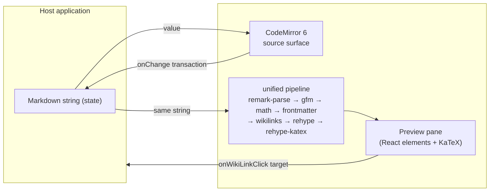

# System Overview

## The one invariant: plain text is canonical

Stylo's public value is a **Markdown string**. There is no intermediate document
model that must be serialized back to text. Everything the editor does —
rendering a preview, styling the source, resolving a `[[wikilink]]`, typesetting
`$e^{i\pi}+1=0$` — is a pure function of that string plus cursor state.

This is the Obsidian stance, and it is a deliberate rejection of the
ProseMirror / Lexical / TipTap model, where the source of truth is a tree and
Markdown is an import/export format. That model is lossy for YAML frontmatter,
wikilinks, and math, and it fights any other tool that edits the same files. See
[ADR-001](../../journal/2026-09/2026-09-01_adr-001-editor-architecture.md) for the
full argument.

## Composed, not adopted

Stylo assembles four well-scoped libraries rather than taking on an editor
framework:

| Concern          | Library                                                                    | Role |
| ---------------- | ------------------------------------------------------------------------- | ---- |
| Editing surface  | CodeMirror 6 (`@codemirror/lang-markdown`, `@codemirror/language-data`)   | Text input, selection, syntax-aware source styling, toolbar commands as transactions |
| Render / preview | `react-markdown` + `remark-gfm` + `remark-math` + `rehype-katex` + `katex` | Markdown string → React element tree for the preview pane |
| `[[wikilinks]]`  | small custom `remark` plugin (~30 LOC)                                     | Rewrites `[[target]]` / `[[target\|label]]` into link nodes with a `data-wikilink` target |
| Frontmatter      | `remark-frontmatter` (render side) + `gray-matter` (parse side)           | Keeps the leading `---` YAML block out of the rendered body; exposes it as structured data to the host |

Every dependency is modular, tree-shakeable, and MIT.

## Data flow

The source surface and the preview never talk to each other. Both derive from the
same string; the host owns that string.

## View modes

`<Stylo mode>` selects which derivations are mounted:

- `source` — CodeMirror only.
- `preview` — pipeline output only.
- `split` — both, side by side, sharing scroll position.

A later milestone may add an Obsidian-style **inline live preview** (rendered
Markdown *inside* the CodeMirror surface via view decorations). That is additive
and does not change the invariant above; it is explicitly out of scope for the
first release.

## What Stylo does not own

- **Persistence.** The host holds the string and decides when to save.
- **Navigation.** `onWikiLinkClick` hands the target back to the host; Stylo has
  no router and no vault index.
- **Theme.** Stylo ships structural CSS and CSS-variable hooks; colour is the
  host's.
