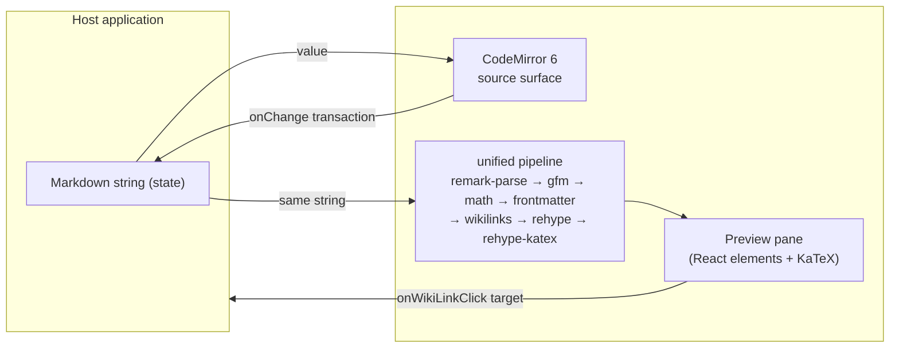

# System Overview

## The one invariant: plain text is canonical

Stylo's public value is a **Markdown string**. There is no intermediate document
model that must be serialized back to text. Everything the editor does —
rendering a preview, styling the source, resolving a `[[wikilink]]`, typesetting
`$e^{i\pi}+1=0$` — is a pure function of that string plus cursor state.

This is the Obsidian stance, and it is a deliberate rejection of the
ProseMirror / Lexical / TipTap model, where the source of truth is a tree and
Markdown is an import/export format. That model is lossy for YAML frontmatter,
wikilinks, and math, and it fights any other tool that edits the same files. See
[ADR-001](../../journal/2026-09/2026-09-01_adr-001-editor-architecture.md) for the
full argument.

## Composed, not adopted

Stylo assembles four well-scoped libraries rather than taking on an editor
framework:

| Concern          | Library                                                                    | Role                                                                                                   |
| ---------------- | -------------------------------------------------------------------------- | ------------------------------------------------------------------------------------------------------ |
| Editing surface  | CodeMirror 6 (`@codemirror/lang-markdown`)                                 | Text input, selection, syntax-aware source styling, toolbar commands as transactions                   |
| Render / preview | `react-markdown` + `remark-gfm` + `remark-math` + `rehype-katex` + `katex` | Markdown string → React element tree for the preview pane                                              |
| `[[wikilinks]]`  | small custom `remark` plugin (~30 LOC)                                     | Rewrites `[[target]]` / `[[target\|label]]` into link nodes with a `data-wikilink` target              |
| Frontmatter      | `remark-frontmatter` (render side) + `gray-matter` (parse side)            | Keeps the leading `---` YAML block out of the rendered body; exposes it as structured data to the host |

Every dependency is modular, tree-shakeable, and MIT.

## Data flow

The source surface and the preview never talk to each other. Both derive from the
same string; the host owns that string.

## View modes & UI Surfaces

The UX layer, customization API, and design-token system are specified in
[ADR-002](../../journal/2026-09/2026-09-01_adr-002-editor-ux-and-customization.md).

`<Stylo mode>` selects the interaction layout:

- `in-place` (**default**) — Notion-like canvas: headings, emphasis, links and
  wikilinks, `$…$` / `$$…$$` math, rules, blockquotes, list bullets, task
  checkboxes, and GFM tables render live in the CodeMirror surface via view
  decorations, with the raw source revealed under the caret. Fenced-code syntax
  highlighting stays as source for now (waits on the `codeLanguages` prop);
  rendered table cells show their text verbatim, without inline formatting.
  Architecture and node set in
  [ADR-004](../../journal/2026-09/2026-09-01_adr-004-in-place-decoration-canvas.md).
- `source` — raw CodeMirror Markdown text surface; loads no render chunk.
- `preview` — rendered HTML/KaTeX preview pane.
- `split` — side-by-side editing and preview with synchronized scroll.

**All four modes are implemented.** `in-place` is the default per ADR-002 §1;
it and `preview` / `split` load their render pipeline as a lazy chunk, so a
`mode="source"` consumer stays at the CodeMirror-only baseline. See the
[in-place canvas tracker](../../journal/2026-09/2026-09-01_in-place-canvas.md),
the [foundation milestone](../../journal/2026-09/2026-09-01_foundation-milestone.md),
and the [split-mode note](../../journal/2026-09/2026-09-01_split-mode.md).

### UI layers

**First release:**

1. **Adaptive canvas** — responsive writing surface themed through a small set of
   CSS custom properties: `--stylo-bg`, `--stylo-text`, `--stylo-text-muted`,
   `--stylo-border`, `--stylo-accent`, `--stylo-link`, `--stylo-ring`,
   `--stylo-radius`. Defaults follow shadcn/ui's neutral conventions as a visual
   reference; no Tailwind or shadcn code is bundled.
2. **Declarative toolbar** — a single ordered `items` list of command ids with
   `"|"` separators, `toolbar={false}` to hide it, and a per-id `icons`
   override (inline-SVG built-ins, no icon dependency). Shipped 2026-09-02; see
   [[reference/toolbar|the toolbar reference]] and the ADR-002 §2 amendment.

**Deferred (post-v1, additive — see ADR-002):** the `left` / `right` docks, the
`overflow` mode, a `headings` dropdown sub-config, the context-aware selection
tooltip, and the `<StyloToolbarSettings />` drag-and-drop customizer with
magnetic docks.

Internal UI is styled with CSS Modules compiled to a single `dist/styles.css`;
consumers import it once and need no build-time CSS tooling.

## What Stylo does not own

- **Backend persistence.** The host holds the string and decides when to save
  (deferred `autoSave` hook, or `onSave`).
- **Navigation.** `onWikiLinkClick` hands the target back to the host; Stylo has
  no router and no vault index.
- **Brand colors.** Stylo ships scoped CSS and a design-token surface; the theme
  palette is inherited from the host.
- **KaTeX stylesheet.** Stylo's CSS is KaTeX-font-free; the consumer imports
  `@damiro/stylo/katex.css` (or KaTeX's own CSS) once. See
  [ADR-003](../../journal/2026-09/2026-09-01_adr-003-katex-math-rendering.md).
